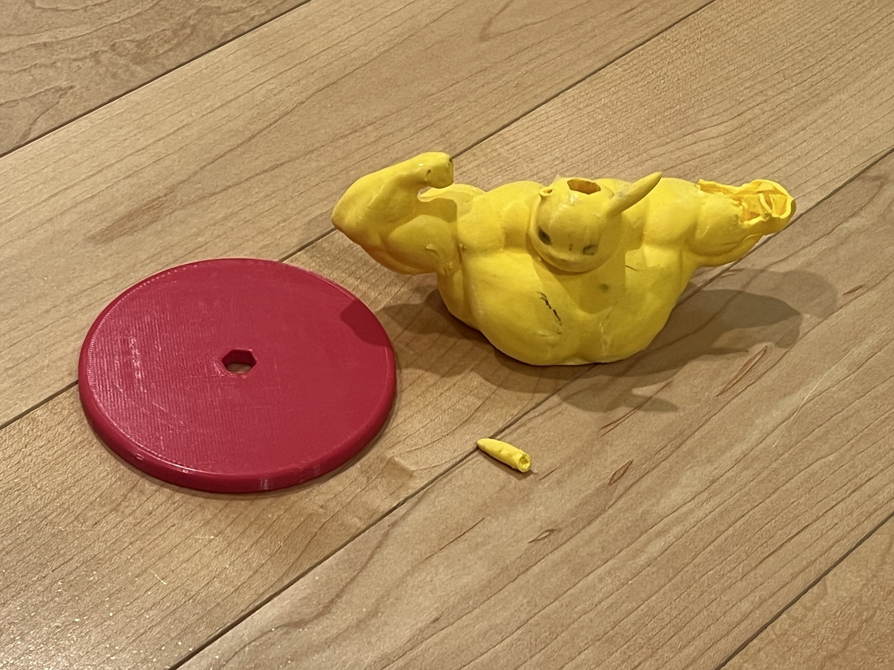
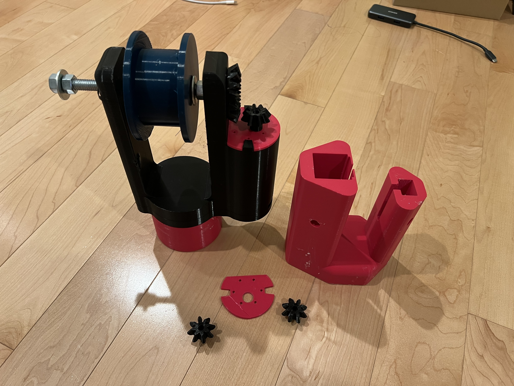
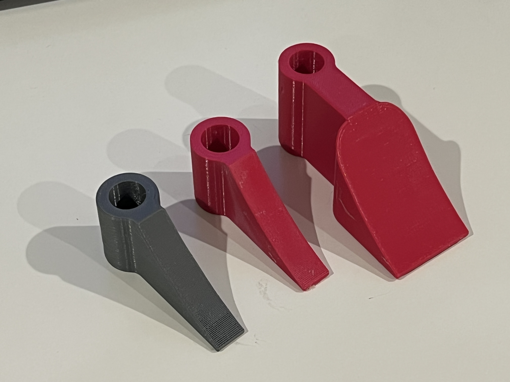
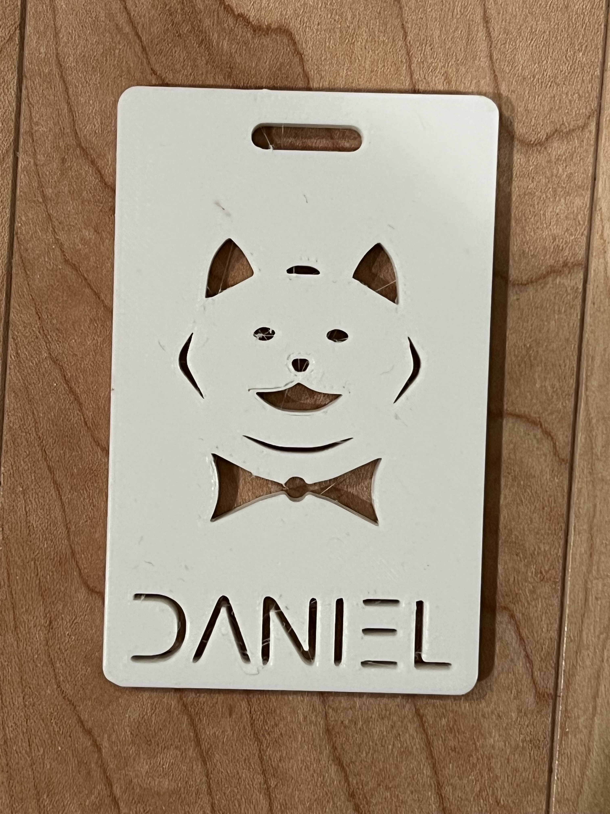

# COSMOS-2022
## Prints I made during COSMOS summer program at UCSD
`LoRa Chip Holder.stl`: Puck that held LoRa antenna  
`pH Sensor Holder.stl`: Held pH sensor to buoy  
`Pikachu LoRa.stl`: Pikachu that held LoRa antenna  
`Water Resistance Studs.stl`: Studs that lifted chips off buoy floor  
### Modular Attachment  
`Bottom.stl`: Bottom Lego piece  
`Top.stl`: Top Motor casing  
`Modular Attachment.stl`: Both combined  
### Motor Casing  
`Body.stl`: Main frame  
`Gear 1.stl`   
`Gear 2.stl`  
`Lid.stl`: Held motor down  
`Motor.stl`: Motor model  
`Reel.stl`: Reel to wind up capsule  
`Motor Casing.stl`: Entire casing  
### Onshape Learning
`Name Tag.stl`  
`Pac Man.stl`  
`Tissue Box.stl`  
`Vase.stl`  
## Images
**LoRa Holder**  
  

**Motor casing for the reel that raises and lowers the sensor capsule**  
  

**Sensor Holders: TDS Sensor (2 left) and pH Sensor (far right) holder**  
  

**Name tag**  
  